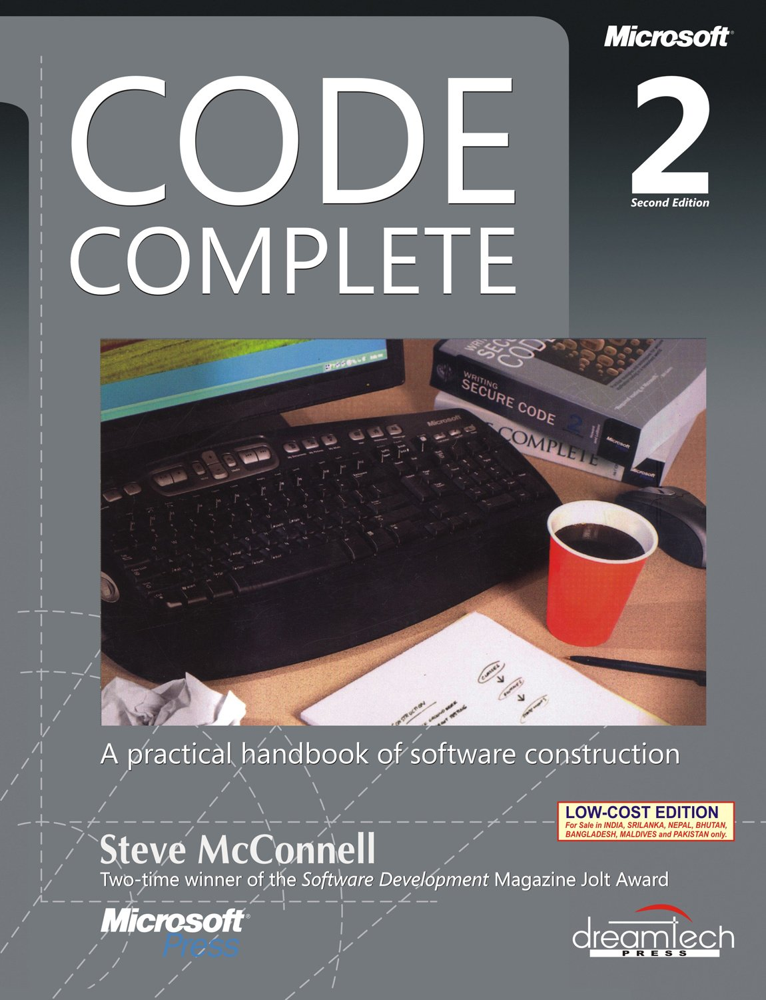

# TỔNG HỢP CÁC CUỐN SÁCH

## Cấu trúc

```
- Tại Index chỉ có bìa và nội dung chung chung
  - Hình ảnh bìa
  - Nội dung tóm tắt ngắn gọn
  - Định dạng file
  - Vị trí thư mục chứa
- Mỗi cuốn sách sẽ có mã số cấu trúc:
  - Viết tắt tên hoặc loại ngôn ngữ và số thứ tự tăng dần
- Thư mục images sẽ chứa thư mục theo mã sách:
  - Hình ảnh bìa sách
  - Các mục lục của sách
  - Một số hình ảnh của sách được cắt ra
- Thư mục Detail:
  - Có 1 file mã `mã sách.md` để mô tả chi tiết về cuốn sách
  - Lấy hình ảnh của sách
  - Các trích đoạn nội dung của sách được thêm vào file chi tiết này.
- Ban đầu sẽ tuân theo vị trí của thư mục ổ cứng có sẵn để tạo nội dung của cuốn sách.
```

## 01. Tuyển chọn (Knowledge Base)

### Code Complete 2: A Practical Handbook of Software Construction(Steve McConnell) [KB00-001]



Widely considered one of the best practical guides to programming, Steve McConnell’s original CODE COMPLETE has been helping developers write better software for more than a decade. Now this classic book has been fully updated and revised with leading-edge practices—and hundreds of new code samples—illustrating the art and science of software construction.
Capturing the body of knowledge available from research, academia, and everyday commercial practice, McConnell synthesizes the most effective techniques and must-know principles into clear, pragmatic guidance. No matter what your experience level, development environment, or project size, this book will inform and stimulate your thinking—and help you build the highest quality code.

Discover the timeless techniques and strategies that help you:

- Design for minimum complexity and maximum creativity
  Reap the benefits of collaborative development
- Apply defensive programming techniques to reduce and flush out errors
- Exploit opportunities to refactor—or evolve—code, and do it safely
- Use construction practices that are right-weight for your project
- Debug problems quickly and effectively
- Resolve critical construction issues early and correctly
- Build quality into the beginning, middle, and end of your project

Detail more [here](./detail/KB00-001.md "Code Complete: A Practical Handbook of Software Construction").

```
Categories: Computers - Programming
Edition: 2
Publisher: Microsoft Press
Year: 2004
Language: english
Pages: 1687
ISBN: 78-0-7356-1967-8
File: PDF, 10.33 MB
```

### The Pragmatic Programmer: Your Journey to Mastery, 20th Anniversary Edition(2019 - Andrew Hunt, David Hurst Thomas) [KB00-002]


Straight from the trenches,The Pragmatic Programmer, 20th Anniversary Editioncuts through the increasing specialization and technicalities of modern software development to examine the core process: transforming a requirement into working, maintainable code that delights users. Extensively updated with ten new sections and major revisions throughout, this edition covers topics ranging from career development to architectural techniques for keeping code flexible, adaptable, and reusable.
Organized into self-contained sections -- and filled with compelling anecdotes, examples, and analogies -- The Pragmatic Programmer illustrates today's best practices and major pitfalls of many different aspects of software development. Wherever possible, the authors abstract away specific technologies, focusing on insights you can apply no matter what tools or languages you use -- or will use.
Whether you're a new coder, an experienced programmer, or a manager responsible for software projects, applying this guide's lessons will help you rapidly improve your productivity, quality, and job satisfaction. You'll learn skills and develop habits and attitudes that form the foundation for long-term success in your career. You'll become a Pragmatic Programmer.

Detail more [here](./detail/KB00-002.md "The Pragmatic Programmer").

```
Categories: Computers - Programming
Year: 2019
Edition: Hardcover
Publisher: Addison-Wesley Professional
Language: english
Pages: 352 / 497
ISBN 10: 0135957052
ISBN 13: 9780135957059
Series: 2nd
File: PDF, 4.20 MB
```

03.Clean Code A Handbook of Agile Software Craftmanship-Robert C. Martin.pdf

04.The Clean Coder\* A Code of Conduct for Professional Programmers (Robert C. Martin Series) (2011, Prentice Hall).pdf

05.Clean Architecture\* A Craftsman’s Guide to Software Structure and Design (2017, Prentice Hall) Robert C. Martin.pdf

05.The Mythical Man-Month\* Essays on Software Engineering-Frederick P. Brooks, Anniversary Edition (2nd Edition) (1995, Addison-Wesley Professional).pdf

06.Peopleware\* Productive Projects and Teams-Tom DeMarco, Tim Lister (2013, Addison-Wesley Professional).pdf

07.Programming Elixir ≥ 1.6 Functional \_Concurrent \_Pragmatic \_Fun[The Pragmatic Programmers] Dave Thomas(2018, Pragmatic Bookshelf).pdf
08.Grokking Algorithms* An illustrated guide for programmers and other curious people Aditya Bhargava(2016, Manning Publications).pdf
08.Grokking Algorithms* An Illustrated Guide for Programmers and Other Curious People-Aditya Bhargava(2016, Manning Publications).pdf
09.Programming Pearls - Jon Bentley(2nd Edition) (1999, Addison-Wesley Professional).pdf
10.The Design of Everyday Things - Revised and Expanded Edition - Don Norman(2013, Basic Books).pdf
11.Cracking the Coding Interview, 6th Edition* 189 Programming Questions and Solutions-Gayle Laakmann McDowell(2015, CareerCup).pdf
12.Refactoring* Improving the Design of Existing Code [Addison-Wesley Object Technology Series] Martin Fowler (2018, Addison-Wesley Professional).pdf 13. Moonwalking with Einstein\* The Art and Science of Remembering Everything by Joshua Foer(2011, Penguin Press).pdf
13.Moonwalking with Einstein _ the art and science of remembering everything by Joshua Foer (2011, Penguin Group ).pdf
14.Soft Skills_ The software developer's life manual by John Z. Sonmez(2014, Manning).pdf

15.The software craftsman professionalism, pragmatism, pride by Sandro Mancuso.pdf

16.Design it _The Pragmatic Programmers by Michael Keeling - Design It!_ From Programmer to Software Architect (2017, Pragmatic Bookshelf).pdf
