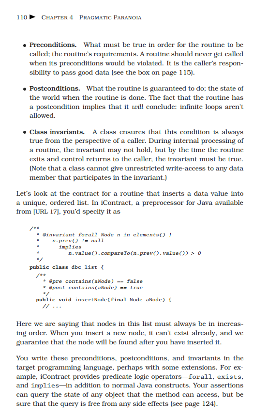

## The Pragmatic Programmer: Your Journey to Mastery, 20th Anniversary Edition(2019 - Andrew Hunt, David Hurst Thomas) [KB00-002]

Straight from the trenches,The Pragmatic Programmer, 20th Anniversary Editioncuts through the increasing specialization and technicalities of modern software development to examine the core process: transforming a requirement into working, maintainable code that delights users. Extensively updated with ten new sections and major revisions throughout, this edition covers topics ranging from career development to architectural techniques for keeping code flexible, adaptable, and reusable.
Organized into self-contained sections -- and filled with compelling anecdotes, examples, and analogies -- The Pragmatic Programmer illustrates today's best practices and major pitfalls of many different aspects of software development. Wherever possible, the authors abstract away specific technologies, focusing on insights you can apply no matter what tools or languages you use -- or will use.
Whether you're a new coder, an experienced programmer, or a manager responsible for software projects, applying this guide's lessons will help you rapidly improve your productivity, quality, and job satisfaction. You'll learn skills and develop habits and attitudes that form the foundation for long-term success in your career. You'll become a Pragmatic Programmer.

(tạm dịch: Lập trình viên thực dụng - Andy Hunt, Dave Thomas)

Cuốn sách là một trong những cuốn sách được khuyên đọc nhiều nhất bởi các lập trình viên “lão làng” trên toàn thế giới. “The Pragmatic Programmer” tạm dịch là “Lập trình viên thực dụng” không dạy bạn cách viết code một cách chính xác và chuẩn chỉnh, mà chỉ chính xác cách mà bạn nên tiếp cận việc phát triển một phần mềm/website.

Được xuất bản lần đầu tiên vào năm 1999, đã hơn 20 năm nhưng “The Pragmatic Programmer” vẫn là một cuốn kim chỉ nang với rất nhiều beginner code với những giá trị xuyên suốt và không thay đổi theo thời gian.

Lời tựa đầu cuốn sách đã phần nào nói lên được sức ảnh hưởng của nó, và đúng là như vậy, trong suốt 20 năm qua.

“This book will help you become a better programmer”. - Cuốn sách này sẽ giúp bạn trở thành một lập trình viên giỏi hơn.

Nó không tập trung vào lý thuyết lập trình mà chỉ đơn giản đề cập đến hành động thực tiễn. “Lập trình cũng giống như một nghề thủ công. Nói một cách đơn giản nhất, với một chiếc máy tính, bạn có thể yêu cầu nó làm bất cứ điều gì bạn muốn nó làm. Là một lập trình viên, với chiếc máy tính của mình, bạn vừa là một người lắng nghe, vừa là một cố vấn, một phiên dịch viên và cũng chính là một kẻ độc tài”.

Cuốn sách được viết bởi Andrew Hunt và David Thomas, là những kiến thức chuyên ngành về kỹ thuật phần mềm. Kiến thức trong Pragmatic Programmer có thể áp dụng cho tất cả các ngôn ngữ lập trình. Các chủ đề chính trong sách là thiết kế cấu trúc để code cũng như trách nhiệm công việc của mỗi lập trình viên nói chung. Bên cạnh những kiến thức chuyên ngành, Pragmatic Programmer còn đề cập tới một số chủ đề rất thú vị như “tracer bullets” (đối tượng hướng đến); chống lại lỗi phần mềm; bảo vệ code bằng hợp đồng, điều khoản và ngoại lệ; xây dựng một team coder chuyên nghiệp; tách quyền xem khỏi code mẫu và khiến cho chương trình đáng giá… Ngoài ra, tác giả còn vạch ra những khía cạnh hạn chế của các ngôn ngữ lập trình bằng các ví dụ ý nghĩa và nhiều đoạn hội thoại dí dỏm. Tóm lại cuốn sách chắc chắn sẽ thay đổi tư duy và thói quen, giúp lập trình viên trở nên chuyên nghiệp hơn, và dễ dàng làm việc trong môi trường quốc tế.
